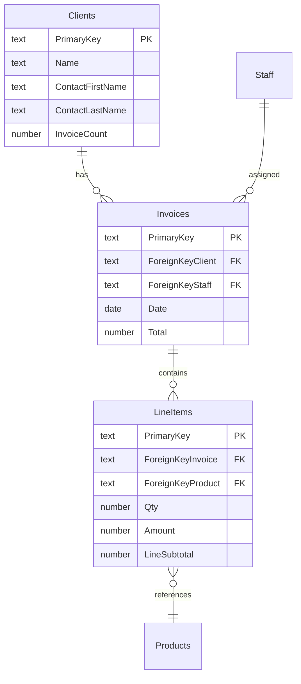

# Extract ERD

This skill analyzes a FileMaker solution's relationship graph and produces a **true ERD** as a Mermaid diagram — collapsing utility table occurrences down to base tables and letting the developer classify which relationships represent genuine entity connections.

**Purpose**: Give a developer who is new to a solution a quick, accurate, high-level understanding of its data model.

**Output**: A Mermaid `erDiagram` file written to `agent/sandbox/`.

## Data sources

The skill uses two possible data sources, in order of preference:

### 1. Exploded XML index files (preferred)

When `agent/context/{solution}/` exists with index files:

- `table_occurrences.index` — TO-to-base-table mapping (columns: `TOName|TOID|BaseTableName|BaseTableID`)
- `relationships.index` — all relationships between TOs (columns: `LeftTO|LeftTOID|RightTO|RightTOID|JoinType|JoinFields|CascadeCreate|CascadeDelete`)
- `fields.index` — all fields per base table (columns: `TableName|TableID|FieldName|FieldID|DataType|FieldType|AutoEnter|Flags`)

### 2. OData `$metadata` endpoint (fallback)

When index files are not available but `agent/config/automation.json` has an `odata` block for the solution:

- Fetch `{base_url}/{database}/$metadata` with Basic auth
- Parse `EntityType` elements for fields and types
- Parse `NavigationProperty` and `NavigationPropertyBinding` for relationships
- **Infer base tables** by grouping EntityTypes with identical field sets (same field names in same order = same base table). OData exposes TOs, not base tables — this heuristic resolves the mapping.

If neither source is available, instruct the developer to either run **Explode XML** or configure OData access.

## Workflow

### Step 1 — Determine the solution

List subdirectories under `agent/context/` using Bash `ls`.

- If one subfolder exists, use it automatically.
- If multiple exist, use `AskUserQuestion` to ask which solution.
- If none exist, check `automation.json` for OData config and fall back to the OData path.

### Step 2 — Gather raw data

**Index file path:**

1. Read `table_occurrences.index` → build a map of `TOName → BaseTableName`
2. Read `relationships.index` → collect all relationships
3. Read `fields.index` → collect all fields grouped by base table

**OData path:**

1. Fetch `$metadata` from the OData endpoint
2. Parse all `EntityType` elements — extract field names, types, and annotations
3. Group EntityTypes by identical field name lists → infer base table groups
4. Parse `NavigationProperty` elements → extract TO-level relationships
5. Map relationships to inferred base tables

### Step 3 — Collapse to base tables

For each relationship, resolve both sides from TO names to base table names. This produces a list of **base-table-level relationships**, where multiple TO-level relationships between the same two base tables are grouped together.

For each base-table pair, collect:
- All TO pairs that connect them
- The join field(s) for each TO pair
- Join type (Equal, >, <, etc.)
- Cascade settings

### Step 4 — Classify tables and pre-classify relationships

#### Table classification

Classify each base table into one of three categories. These are **suggestions only** — the developer makes the final call.

**ENTITY** — a first-class business object that exists independently:
- Has a `PrimaryKey` field
- Has descriptive/attribute fields beyond just keys and timestamps (e.g., Name, Status, Address)
- Other tables reference it via foreign keys
- Examples: Clients, Products, Staff, Invoices

**JOIN** — exists primarily to connect two entities (associative/junction table):
- Has a `PrimaryKey` field
- Has **two or more `ForeignKey*` fields** pointing to other tables
- Has few or no descriptive fields beyond the keys, timestamps, and fields derived from the parent entities
- Often has cascade delete from a parent
- May carry payload fields (Qty, Amount) but its primary purpose is connecting entities
- Examples: Line Items (connects Invoices and Products), Enrollments (connects Students and Courses)

**UTILITY** — a table that supports the solution but is not part of the core data model:
- Settings/preferences tables (Admin, Config) — single-record, global fields, UI flags
- Navigation/selector tables — used for UI state, global search, or card windows
- Log/audit tables — append-only records for tracking activity
- Temporary/staging tables — used for imports, exports, or intermediate processing
- Has no foreign keys pointing to it from other tables (or very few)
- Not part of the entity model — suggest excluding from the ERD

Heuristics to auto-classify:

| Signal | Points toward |
|--------|--------------|
| 2+ ForeignKey fields | JOIN |
| Cascade delete enabled on a parent relationship | JOIN |
| Few non-key, non-timestamp fields | JOIN |
| Multiple global fields | UTILITY |
| No inbound FK references from other tables | UTILITY |
| Rich descriptive fields (Name, Address, Phone, etc.) | ENTITY |
| Other tables reference it via FK | ENTITY |

#### Relationship pre-classification

Apply heuristics to suggest a classification for each base-table relationship. These are **suggestions only** — the developer makes the final call.

**Likely TRUE ERD:**
- Join uses `PrimaryKey` on one side and a `ForeignKey*` field on the other
- Join type is `Equal`
- Cascade delete is enabled (strong signal of parent-child)
- Field naming follows FK convention (`ForeignKey{TableName}`, `FK{TableName}`, `{TableName}ID`)

**Likely UTILITY:**
- Join fields are not PK/FK (e.g., `ForeignKeyStaff = CreationTimestamp`)
- Join type is not `Equal` (cartesian, inequality joins)
- Self-join where both sides are the same base table and join fields are not PK = PK
- Multiple TO pairs exist for the same base-table pair and this particular pair uses non-standard join fields

**UNCERTAIN:**
- Mixed signals — present the evidence and let the developer decide

### Step 5 — Present the relationship report

Display a structured report with three sections:

#### Base Tables

List each base table with its classification, TO count, and total field count:

```
Base Tables (N total):
  1. Clients        ENTITY    — 2 TOs (Clients Primary, Clients Secondary) — 26 fields
  2. Invoices       ENTITY    — 3 TOs (Invoices, Invoices 2, Invoices 3)   — 23 fields
  3. Line Items     JOIN      — 2 TOs (Line Items, Line Items 2)           — 13 fields
  4. Products       ENTITY    — 1 TO  (Products)                           — 13 fields
  5. Staff          ENTITY    — 1 TO  (Staff)                              — 16 fields
  6. Admin          UTILITY   — 1 TO  (Admin)                              — 25 fields
```

#### Relationships

For each base-table-level relationship, show:

```
Relationship N: Clients → Invoices
  Classification: TRUE ERD ✓
  Reasoning: PrimaryKey = ForeignKeyClient (PK→FK pattern, Equal join)
  TO pairs:
    • Clients Primary → Invoices  |  PrimaryKey = ForeignKeyClient  |  Equal  |  no cascade
  Suggested cardinality: one-to-many (1 Client has many Invoices)

Relationship N: Invoices → Invoices (self-join)
  Classification: UTILITY ✗
  Reasoning: ForeignKeyStaff = CreationTimestamp — non-PK/FK join fields, likely a filtered portal relationship
  TO pairs:
    • Invoices → Invoices 2  |  ForeignKeyStaff = CreationTimestamp  |  Equal  |  no cascade
    • Invoices → Invoices 3  |  ForeignKeyStaff = ForeignKeyClient   |  Equal  |  no cascade
```

### Step 6 — Developer confirmation

Use `AskUserQuestion` to present the full report and ask the developer to confirm or adjust the classifications.

**Prompt**: Present the report above, then ask:

> Review the table and relationship classifications above. Reply with any changes (e.g., "Line Items is an ENTITY not a JOIN", "Relationship 3 should be TRUE ERD") or confirm with "looks good" to proceed.

If the developer adjusts any classifications, update accordingly before proceeding.

### Step 6b — Field inclusion

After classifications are confirmed, use `AskUserQuestion` to ask about field detail level:

> How much field detail in the diagram?
>
> 1. **Full** — all fields per table (best for small solutions, can be large for 100+ field tables)
> 2. **Keys only** — PrimaryKey and ForeignKey fields only (compact, focuses on relationships)
> 3. **Keys + business fields** — PKs, FKs, and non-system fields (excludes CreationTimestamp, CreatedBy, ModificationTimestamp, ModifiedBy, FoundCount, and similar audit/system fields)

Default to option 3 if the developer doesn't have a preference. For solutions with any table exceeding 50 fields, mention the field counts and recommend option 2 or 3.

### Step 7 — Determine cardinality

For each confirmed TRUE ERD relationship, infer cardinality:

| Pattern | Cardinality | Mermaid syntax |
|---------|-------------|----------------|
| PK on left, FK on right | One-to-many | `\|\|--o{` |
| FK on left, PK on right | Many-to-one | `}o--\|\|` |
| PK on both sides | One-to-one | `\|\|--\|\|` |
| FK on both sides | Many-to-many (rare in FM) | `}o--o{` |

When the pattern is ambiguous, default to one-to-many and add a comment.

### Step 8 — Generate the Mermaid diagram

Build an `erDiagram` with:

- **ENTITY and JOIN tables** (exclude UTILITY tables unless the developer overrode the classification)
- **Fields filtered** according to the developer's choice in Step 6b
- **Only TRUE ERD relationships** (confirmed in Step 6)
- **Cardinality notation** from Step 7
- **Relationship labels** derived from the FK field name (e.g., `ForeignKeyClient` → `"has"` or `"belongs to"`)

Add a Mermaid comment (`%%`) above each table indicating its classification (ENTITY or JOIN) so the diagram is self-documenting.

#### Field inclusion by mode

| Mode | Include | Exclude |
|------|---------|---------|
| **Full** | All fields | Nothing |
| **Keys only** | PrimaryKey, ForeignKey*, FK* fields | Everything else |
| **Keys + business** | All fields except system/audit fields | CreationTimestamp, CreatedBy, ModificationTimestamp, ModifiedBy, FoundCount, and fields with `global` flag |

#### Field type mapping

Map FileMaker field types to concise Mermaid-compatible labels:

| FileMaker type | Mermaid label |
|----------------|---------------|
| Text | text |
| Number | number |
| Date | date |
| Timestamp | timestamp |
| Time | time |
| Binary (Container) | container |

#### Field annotations

| Condition | Annotation |
|-----------|------------|
| Field named `PrimaryKey` or has `notEmpty,unique` flags | `PK` |
| Field name starts with `ForeignKey` or `FK` | `FK` |
| FieldType is `Calculated` | (append type from calc, keep annotation if PK/FK) |
| FieldType is `Summary` | (label as `summary`) |

#### Mermaid template



### Step 9 — Write to sandbox

Write the Mermaid file to `agent/sandbox/{solution-name}-erd.md` with a brief header:

```markdown
# {Solution Name} — Entity Relationship Diagram

Generated: {date}
Source: {index files | OData $metadata}
Relationships: {N true ERD} confirmed, {N utility} excluded

{mermaid diagram}
```

Report the file path to the developer.

## Key considerations

- **Utility tables**: Many FM solutions have tables that support the application but aren't part of the core data model — settings/preferences (Admin, Config), navigation/selector tables, log/audit tables, staging/temp tables. Surface them in the base table list as UTILITY but suggest excluding from the ERD unless the developer says otherwise.
- **Self-joins**: FM commonly uses self-join TOs for filtered portals (e.g., showing only active invoices). These are almost always utility, not true ERD. Flag them clearly.
- **Multi-predicate joins**: Some relationships have compound join fields (`;`-separated in the index). Show all predicates — compound joins are more likely to be utility relationships.
- **External data sources**: TOs marked as external (type != "Local" in the relationship XML) should be noted — they reference tables in other FM files.
- **Large solutions**: For solutions with 50+ base tables or 100+ relationships, consider grouping the report by domain or presenting in batches to avoid overwhelming the developer.

## Examples

### Example 1 — Standard solution with index files

User: "I'm new to this solution — can you map out the database for me?"

1. `ls agent/context/` → `Invoice Solution/`
2. Read all three index files
3. Collapse 11 TOs to 6 base tables, 7 relationships to ~4 unique base-table pairs
4. Pre-classify: 4 TRUE ERD (Clients→Invoices, Staff→Invoices, Invoices→Line Items, Line Items→Products), 2 UTILITY (Invoices self-joins), 1 UNCERTAIN (Clients Secondary→Line Items 2)
5. Present report, developer confirms
6. Generate Mermaid erDiagram with 5 entity tables and 4 relationships
7. Write to `agent/sandbox/Invoice Solution-erd.md`

### Example 2 — No index files, OData available

User: "Extract the ERD for this solution"

1. `ls agent/context/` → empty
2. Check `automation.json` → OData config exists for the solution
3. Fetch `$metadata`, parse EntityTypes and NavigationProperties
4. Group identical field sets → infer 6 base tables from 11 EntityTypes
5. Continue from Step 3 as normal

### Example 3 — Neither source available

User: "Show me the ERD"

1. No index files, no OData config
2. Report: "I need either exploded XML or OData access to extract the ERD. Would you like to run **Explode XML** to generate the index files, or configure OData in `automation.json`?"
